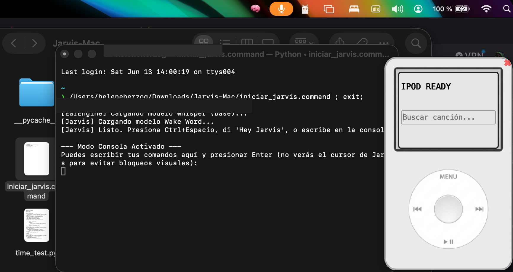

# 🧠 Omni-Brain

Un asistente virtual impulsado por Inteligencia Artificial de código abierto (Ollama), diseñado para ser **100% privado, rápido y vivir directamente en la barra de menú de tu sistema**.

<br>
<p align="center">
  <video src="https://github.com/elouroboros2-ai/Omni-Brain/raw/main/assets/demo_jarvis.mov" width="80%" controls="controls"></video>
  <br><br>
  
</p>
<br>

Actualmente, **Omni-Brain** está optimizado y diseñado para ejecutarse de manera nativa en **macOS**, aunque su motor interno es multiplataforma y en el futuro se planea lanzar interfaces para Windows y Linux.

## ✨ Características Principales

- **Privacidad Total (Offline):** Omni-Brain utiliza **Ollama** con el modelo `qwen2.5:7b` ejecutándose directamente en tu máquina. Ninguna de tus conversaciones, comandos o transcripciones de voz se envía a la nube.
- **Detección de Palabra de Activación (Wake Word):** Escucha activamente "Hey Jarvis" o tu palabra clave elegida, consumiendo muy pocos recursos, listo para atenderte al instante.
- **Agente Analizador de Streams (Radio y Caché Personal):** Cuenta con un motor algorítmico avanzado que permite la ingesta de metadatos y streams de audio públicos. Omni-Brain analiza y almacena localmente el contenido de forma automatizada en tu caché personal, incluyendo una función de 'Autopilot/Radio' generativa para experimentación musical ininterrumpida. Todo operado directamente desde una interfaz minimalista en la barra de macOS.
- **Motor de Voz Híbrido:** Cuenta con síntesis de voz mediante Edge-TTS (voces hiperrealistas por internet) o Voz Nativa del Sistema (offline y rapidísima).

## 🚀 Instalación (1 Solo Clic)

Hemos preparado un script que se encarga de instalar todo lo necesario automáticamente (Homebrew, Ollama, modelo de IA, librerías de Python).

1. Abre tu **Terminal**.
2. Clona este repositorio o descarga el código fuente.
3. Navega hasta la carpeta descargada:
   ```bash
   cd ruta/a/Omni-Brain
   ```
4. Otorga permisos de ejecución al script y córrelo:
   ```bash
   chmod +x install.sh
   ./install.sh
   ```

*(El instalador configurará tu entorno, descargará el modelo y dejará listo un acceso directo `start.command`)*.

## 🎧 ¿Cómo Usarlo?

Simplemente haz doble clic en el archivo `start.command` generado tras la instalación. Verás aparecer el ícono del cerebro (`🧠`) en la barra de menú superior de tu Mac.

Di: **"Hey Jarvis"** seguido de tu petición. 
- Puedes pedirle a la IA que busque y gestione flujos de audio públicos mediante comandos de voz para estudiarlos de manera local.
- Puedes preguntarle cualquier cosa, y la IA responderá mediante voz de forma inteligente.

## 🛠 Tecnologías Utilizadas

- **Ollama**: Motor de Inferencia Local.
- **Whisper**: Transcripción de Audio (Speech-to-Text).
- **OpenWakeWord**: Detección de palabra de activación.
- **Edge-TTS / Mac OS `say`**: Text-to-Speech.
- **yt-dlp / ffplay**: Motor de búsqueda e integración musical.
- **Rumps**: Integración nativa a la interfaz de macOS.

## 📝 Roadmap a Futuro

- Adaptación a interfaces multiplataforma (`pystray` o `PyQt`) para soportar Windows y Linux de manera nativa.
- Personalización avanzada del modelo y voces desde la misma interfaz.

## ⚠️ Aviso Legal / Disclaimer

Omni-Brain es un proyecto experimental de código abierto destinado estrictamente a **fines educativos, de investigación en IA, automatización y análisis de agentes**. 

El software provee una interfaz para que los usuarios interactúen con herramientas de terceros y APIs de código abierto bajo su propia cuenta y riesgo. El creador y los mantenedores de este proyecto **no almacenan, alojan ni distribuyen** material con derechos de autor, y **no asumen responsabilidad alguna** por el uso que se le dé a este código. 

Toda actividad relacionada con la extracción, almacenamiento en caché o uso de material de internet es responsabilidad única y exclusiva del usuario final, quien debe asegurarse de cumplir rigurosamente con los Términos de Servicio de las plataformas de terceros y las leyes aplicables en su región.

---

¡Explora el mundo de los agentes de Inteligencia Artificial locales y privados! 🧠✨

---
**Tags:** `AI`, `Ollama`, `macOS`, `Virtual Assistant`, `Open Source`, `Local LLM`, `Speech-to-Text`, `Edge-TTS`, `Python`, `Wake Word`, `Agent`, `Automation`
